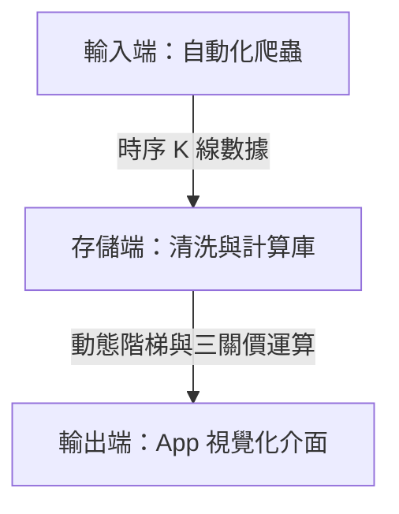

# Range Navigator 產品開放規格說明書（OpenSpec）

## 一、 產品願景與目標使用者（Product Vision & Target Audience）

### 1. 產品願景
`Range Navigator` 旨在解決交易者在面對市場波動時的決策困境。透過融合「市場結構分析」與「動態波動率計算」，將複雜的價格波動轉化為直觀的階梯狀多空支撐壓力線與動態交易區間，以數據驅動的客觀訊號協助交易者克服情緒化決策，建立穩健的交易系統。

### 2. 目標使用者
*   **一般投資人**：在市場中缺乏明確判斷準則，容易受情緒影響、追高殺低的交易者。
*   **量化工具使用者**：偏好數據驅動，希望透過客觀演算法與精確參數輔助決策的交易者。

### 3. 核心問題與解決方案
*   **缺乏方向感**：使用者難以判斷當前市場所處的趨勢狀態（多頭 / 空頭 / 盤整）。
    *   *解決方案*：提供直觀的「趨勢預測畫面」，明確顯示當前市場偏見與未來走勢。
*   **過度依賴主觀經驗**：缺乏客觀的進出場與止損止盈依據，導致交易穩定性低。
    *   *解決方案*：結合平均真實波幅（ATR）與台指期（TX）三關價，計算並顯示具體的動態高低參考範圍，作為進出場的客觀依據。

---

## 二、 產品需求與 MVP 功能（Requirements & MVP Features）

### 1. 趨勢預測畫面（核心）
*   **市場狀態判定**：明確顯示當前市場偏見為「看多（Bullish）」、「看空（Bearish）」或「觀望 / 盤整（Sideways）」。
*   **未來走勢指引**：標示出當前趨勢是否健康（BOS 持續中）或存在潛在反轉風險（出現 MSS 預警）。

### 2. 動態區間提示
*   **即時支撐與壓力階梯**：顯示最佳化後的 `Ladder System` 階梯價格線。
*   **交易範圍界定**：顯示當日的三關價（上關、中關、下關），作為全域的多空分水嶺與極端突破區間。

### 3. 資料回測驗證
*   **歷史數據驗證**：保留過往的時序數據與計算出的階梯、區間數值。
*   **指標準確性回顧**：供使用者在 App 介面上對照歷史走勢，檢驗策略在不同波動率環境下的表現。

---

## 三、 系統架構與資料結構（System Architecture & Data Structure）

### 1. 資料流架構
本系統分為三個核心層次：


### 2. 輸入端資料格式（Input Schema）
爬蟲程式定期抓取的原始時序數據（如 `0050.TW`、`2330` 或台指期近月合約），每筆 K 線數據須包含：
*   `datetime`（DateTime）：時間戳記
*   `open`（Float）：開盤價
*   `high`（Float）：最高價
*   `low`（Float）：最低價
*   `close`（Float）：收盤價
*   `volume`（Float）：成交量

### 3. 運算存儲端資料格式（Processed Data Schema）
儲存經過清洗與核心演算法運算後的衍生數據：
*   `TR`（Float）：真實波幅（True Range）
*   `ATR`（Float）：平均真實波幅（Average True Range）
*   `Middle_Price`（Float）：中關價（當日多空分水嶺）
*   `Upper_Price`（Float）：上關價（強勢多頭突破線）
*   `Lower_Price`（Float）：下關價（強勢空頭突破線）
*   `VWAP`（Float）：成交量加權平均價
*   `MSS_Signal`（Integer / Enum）：結構破壞訊號（1: 看漲 MSS, -1: 看跌 MSS, 0: 無）
*   `BOS_Signal`（Integer / Enum）：結構連續訊號（1: 看漲 BOS, -1: 看跌 BOS, 0: 無）
*   `Ladder_Level`（Float）：當前多空階梯的水平價格
*   `Chandelier_Exit`（Float）：動態吊燈式止損價

### 4. 輸出端顯示規範（Viewer Presentation）
*   **視覺化圖表**：K 線圖上疊加動態階梯線（綠色代表多頭階梯，紅色代表空頭階梯）與三關價線（點線標示）。
*   **文字面板**：即時更新當前交易偏見（如：「強勢多頭，價格高於上關價，建議順勢做多」），並給出具體的支撐壓力數值。

---

## 四、 核心演算法與交易邏輯（Core Algorithm & Trading Logic）

多空階梯系統（Ladder System）的最佳化核心在於將市場結構（MSS / BOS）、全域波動率（ATR）與機構定價參考（VWAP、三關價）進行深度融合。

### 1. 結構破壞（MSS）與結構連續（BOS）
為避免盤整時的隨機噪音，系統採用市場結構動力學區分趨勢反轉與持續：
*   **結構破壞（Market Structure Shift, MSS）**：
    *   在多頭趨勢中，價格以強勁動能（Displacement）跌破前一個關鍵的波段低點（HL），即觸發「看跌 MSS」偏見移位。
    *   在空頭趨勢中，價格以強勁動能突破前一個關鍵的波段高點（LH），即觸發「看漲 MSS」偏見移位。
    *   **伴隨現象**：必須伴隨公平價值缺口（Fair Value Gap, FVG）的形成，代表機構資金進場。
*   **結構連續（Break of Structure, BOS）**：
    *   價格突破既定趨勢方向上的外部波段高點（Uptrend）或低點（Downtrend），作為趨勢持續的確認訊號。此時，多空階梯隨之上移或下移。

| 功能維度 | 結構破壞（MSS） | 結構連續（BOS） |
| :--- | :--- | :--- |
| **定義** | 價格跌破 / 突破反向關鍵波段點 | 價格突破同向波段點 |
| **趨勢含義** | 潛在反轉、偏見移位 | 趨勢加強、慣性延續 |
| **動量要求** | 必須具備強力位移（Displacement） | 常態性突破即可 |
| **主要功能** | 預警止損、尋找反手進場點 | 階梯上 / 下移、部位加碼 |
| **伴隨現象** | 公平價值缺口（FVG） | 持續的趨勢波浪 |

### 2. 波動率錨定與 ATR 計算
階梯的間距與觸發閾值採用動態 ATR 機制：
*   **True Range（TR）計算**：
    $$TR = \max(High - Low, |High - Close_{prev}|, |Low - Close_{prev}|)$$
*   **Average True Range（ATR）計算（採用經典懷爾德平滑法，Wilder's Smoothing）**：
    $$ATR_n = \frac{(n - 1) \times ATR_{prev} + TR}{n}$$
*   **動態閾值**：
    $$\text{階梯觸發閾值} = k \times ATR$$
    在高波動率環境下，自動放寬階梯間距以防隨機掃損；在低波動率環境下縮小間距以精確捕捉突破。

### 3. 台指期三關價全域濾網
引入日線級別的三關價作為全域的交易方向濾網：
*   **中關價（Middle Price）**：
    $$\text{中關價} = \frac{\text{昨日最高價} + \text{昨日最低價}}{2}$$
*   **上關價（Upper Price）**：
    $$\text{上關價} = \text{昨日最低價} + (\text{昨日最高價} - \text{昨日最低價}) \times 1.382$$
*   **下關價（Lower Price）**：
    $$\text{下關價} = \text{昨日最高價} - (\text{昨日最高價} - \text{昨日最低價}) \times 1.382$$

**整合策略矩陣**：
*   價格高於中關價時，系統僅執行多頭階梯邏輯，過濾空頭訊號。
*   價格低於中關價時，系統僅執行空頭階梯邏輯，過濾多頭訊號。
*   突破上關價或跌破下關價時，代表市場進入極端趨勢盤，此時縮小 ATR 乘數（$k$），採取激進追價。

### 4. 進場點多重確認機制
滿足以下四維度確認時，方可觸發交易訊號：
1.  **結構端**：K 線圖上確認出現看漲 / 看跌 MSS 或 BOS 訊號。
2.  **動能端**：訊號 K 線必須為陽線（即看漲收紅 K，或依據國際標準為綠 K），且收盤價高於開盤價。
3.  **趨勢端**：價格同時處於當日開盤價（Daily Open）與 VWAP（成交量加權平均價）之上。
4.  **波動端**：突破當下的單根 K 線振幅必須大於 $1.2$ 倍 ATR，確認具備有效的「位移（Displacement）」。

### 5. 擴充止盈體系（Take Profit Architecture）
為最大化盈虧比，採取複式倉位管理模型：
*   **階段 1（初始目標）**：當獲利達到 $1.5 \times ATR$ 時，平倉 $50\%$ 的部位，立即回收初始風險。
*   **階段 2（保本機制）**：第一階段止盈達成後，將剩餘 $50\%$ 部位的止損價格移至進場價（Entry Price），實現零風險持倉。
*   **階段 3（趨勢跟蹤）**：剩餘部位不設固定止盈點，採用吊燈式止損（Chandelier Exit）動態追蹤利潤：
    $$\text{Chandelier Exit (Long)} = \text{Rolling Max}(High, n) - (ATR_n \times \text{Multiplier})$$
    $$\text{Chandelier Exit (Short)} = \text{Rolling Min}(Low, n) + (ATR_n \times \text{Multiplier})$$
    *   *乘數設定*：一般市場使用 $3.0 \times ATR$；高波動市場使用 $4.0 \times - 5.0 \times ATR$；低波動市場使用 $2.0 \times - 2.5 \times ATR$。
*   **時間與量價過濾**：
    *   *時間止盈（Time-Based Exit）*：進場後 $N$ 根 K 線內若未能脫離成本區，或在當日收盤前 $15$ 分鐘，強制全數平倉，避免隔夜跳空風險。
    *   *量價背離止盈*：若價格創新高（BOS）但成交量與 RSI 動能出現頂背離，主動減倉 $25\%$ 的部位。

---

## 五、 效能優化與防禦看前偏誤（Performance & Look-Ahead Bias Prevention）

### 1. Pandas 向量化運算（Vectorization）
為確保在百萬級 K 線數據回測時的運算效率，核心邏輯應避免使用慢速的 `for` 迴圈，改為使用 Pandas 的 `rolling()`、`shift()` 以及邏輯掩碼。例如：
```python
# 向量化偵測 BOS (突破前 N 週期最高價)
df['prev_high'] = df['high'].rolling(window=period).max().shift(1)
df['BOS_Signal'] = (df['close'] > df['prev_high']) & (df['volume'] > df['volume'].rolling(20).mean())
```

### 2. Numba JIT 加速
針對無法向量化、具備時序遞迴依賴性的運算邏輯（例如動態吊燈止損線），封裝於 `@jit(nopython=True)` 加速器中。
不同計算方法的效能基準測試對比如下：

| 運算方法 | 每 10000 筆數據耗時 (µs) | 效能提升倍率 |
| :--- | :--- | :--- |
| **純 Python 迴圈** | 5200 | 1.0x |
| **Pandas .apply()** | 2800 | 1.9x |
| **Pandas 標準向量化** | 829 | 6.3x |
| **NumPy 向量化** | 165 | 31.5x |
| **Numba @jit 加速** | 87 | 59.8x |

### 3. 防禦看前偏誤（Look-Ahead Bias）
為防範歷史回測出現不真實的績效虛胖：
*   所有結構點判斷必須加上 `.shift(1)`，確保當前決策僅基於已收盤的歷史 K 線。
*   回測模型必須扣除滑點（Slippage）與交易手續費摩擦成本，確保勝率能覆蓋頻繁切換階梯的成本。

---

## 六、 驗收與驗證標準（Acceptance & Verification Criteria）

### 1. 功能性驗收標準
*   **決策輔助達成**：首位使用者在使用 App 後，能清楚說出當前交易方向（看多 / 看空 / 觀望），確認介面語意傳達無誤。
*   **範圍界定明確**：介面能明確顯示今日的高低參考價區間（如：當日三關價數值與 Ladder 階梯價），不可使用模糊的預測描述。
*   **回測一致性**：歷史回測計算出的階梯線，須與即時計算之階梯線完全吻合，誤差為 0。

### 2. 非功能性驗收標準
*   **運算延遲限制**：在接收到新一根分鐘級 K 線時，演算法模組的計算時間須控制在 100 毫秒以內。
*   **系統防呆與容錯**：
    *   若輸入數據遺失（例如爬蟲漏失 K 線），系統應具備插補機制（如向前填補），且不影響後續指標計算的時序正確性。
    *   若遇極端異常值（如股價歸零或出現極大離群值），計算庫須能自動過濾並發出系統警告。
